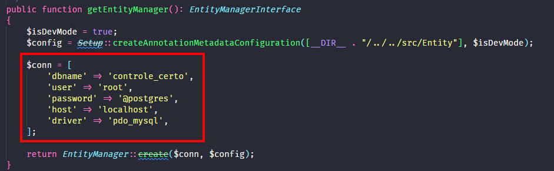
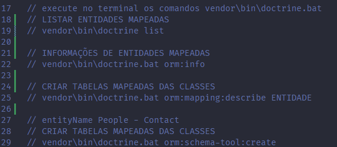
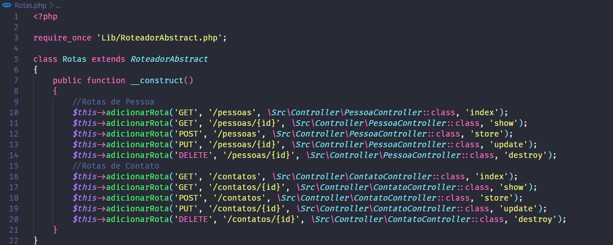

## 🚀 Controle Certo API

API para cadastro de Pessoas e contatos desenvolvida em PHP e utilizando Doctrine ORM para gerenciamento do banco de dados.

## 💻 Inicio

Para utilizar a API, clone o projeto na sua máquina:

git clone https://github.com/Lopes393/controle_certo.git

Após clonar o repositorio, entre na pasta com o comando:

cd controle_certo

Para que o Composer, gerenciador de dependências, possa fazer o download de todas as dependências do projeto, rode:

composer install

## Observação

Estamos utilizando uma dependência chamada 'doctrine/annotations' para ler as anotações nas entidades e o Doctrine ORM 
interpretá-las para serem criadas as tabelas no banco de dados.
Esta dependência está em sua versão 2.0. Para conseguirmos rodar o projeto sem problemas precisamos inicializar a variável
'$useSimpleAnnotationReader' que está dentro de 'vendor\doctrine\orm\lib\Doctrine\ORM\Configuration.php' com valor 'false'.

## Configurações do Projeto

Para utilizar o projeto você precisa de um banco de dados MySQL, se já tiver o SGBD instalado em sua máquina, acesse-o e
crie um novo banco de dados:

create database nome_banco;

Após criar o banco de dados será necessário informar suas informações de conexão para a API em src/Config/EntityManegerFactory.php:

  

Na raiz do projeto, dentro do arquivo 'cli-config.php', contém os comandos necessários para trabalhar com o Doctrine ORM:

  

## Rotas

Na raiz do projeto temos o arquivo 'Rotas.php', onde estão todas as rotas da API:

  

O projeto pode ser executado utilizando Docker, Apache ou no servidor padrão do PHP.

docker-compose up